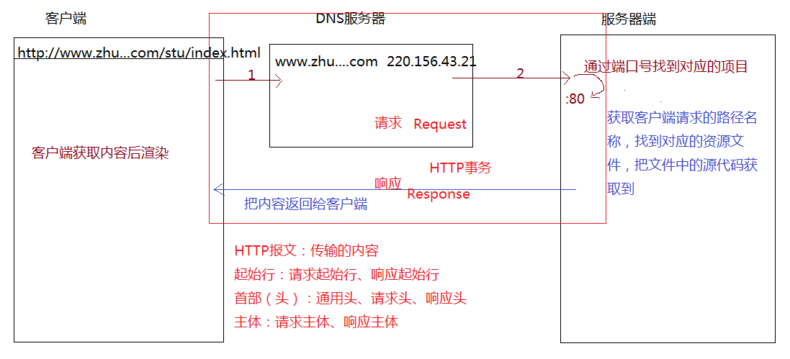
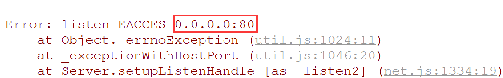

##基于NODE搭建静态资源处理服务器
@(201712)

###面试题：当用户在客户端浏览器输入一个网址，到看到整个页面，中间都经历了什么?
> 1、根据用户输入的域名到DNS服务器上进行解析（域名反解析：通过域名找到对应服务器的外网IP地址）
> 
> 2、通过外网IP地址找到对应的服务器，再通过输入的端口号（HTTP=>80 HTTPS=>443 FTP=>21...）找到服务器上对应的服务
>  
> 3、服务器根据客户端请求的资源文件地址，找到对应的文件，把文件中的源代码准备好
>  
> 4、服务器端把准备好的内容（资源文件源代码或者JSON数据等）返回给客户端
>  
> 5、客户端浏览器拿到代码后，基于自己的内核引擎开始进行页面渲染和绘制
>  
> 此过程中数据内容的传输都是基于传输协议（例如：HTTP）来完成传输的，我们把一个完整的请求过程叫做“HTTP事务：请求+响应”，传输的内容统称为“HTTP报文”...



###内置模块之：HTTP模块
> 这个内置模块是node中一个非常重要的模块，基于这个模块，我们可以完成服务的创建和管理，以及接收客户端的请求，把一些内容返回给客户端等
>  
> HTTP模块创建的服务是基于HTTP传输协议完成请求和响应的；HTTPS也是一个内置模块，它可以让我们的传输基于HTTPS传输协议（比HTTP安全的传输协议）；

**`createServer`**
```javascript
let http = require('http');
let server = http.createServer(()=> {
    console.log('ok');
});
server.listen(9999, ()=> {
    console.log('server is success,listening on 9999 port!');
});
```
> http.createServer([callBack])：在当前服务器上创建一个服务（返回值就是创建的服务），切记，回调函数不是服务创建成功后执行，而是当客户端向当前这个服务发送请求的时候才会被触发执行（不仅触发执行，而且还会传递两个实参值：request、response）

**`listen`**
> [server].listen([port][,callBack])：用创建的服务执行listen这个方法，相当于给服务监听端口号（一台服务器上可能存在多个服务或者项目，端口号是用来区分服务的值）
>  
> 端口号：0~65535取值，同一台服务器上不允许出现相同端口号的服务
> 
> 这样的错误都是端口号被占了（要不然把80服务杀掉，自己用80，要不然自己换一个端口号）
>  
> 回调函数：当端口号监听成功，立即执行回调函数（我们可以在函数中做一些处理，大部分都是给一些成功的提示）

当服务创建成功并且端口号也监听成功了，当前创建的服务会在服务器上一直运行着（必须一直运行着），只有这样，当客户端不管什么时候发请求，才有服务为其处理。

**`客户端如何向创建的服务发请求`**
> 拿当前操作举例
>  
> 1、http://localhost:9999/   向当前自己电脑本地服务发送请求（localhost就是本地服务的意思），要求服务器端和客户端都是自己的电脑
>  
> 2、http://192.168.0.38:9999/  通过局域网IP（内网IP）访问具体的服务（只要大家在同一个局域网内，互相之间可以通过对方的IP地址，访问到对方的服务）
>  
> 都要指定好对应的端口号

**`request && response`**
> 客户端向服务器端发送请求，回调函数被触发执行，回调函数中传递的实参信息值
```javascript
let http = require('http');
http.createServer((req, res)=> {
    //=>req:request 存储客户端的请求信息
    //=>res:response 提供相关的属性和方法,可以让服务器端把内容返回给客户端
}).listen(9999, ()=> {
    console.log('server running');
});
```
> [ req ]
> req.method：存储的是客户端请求的方式（GET或者POST等）
> req.headers：存储客户端发送的请求头全部信息（通过这个属性可以获取请求中的内容）
> req.url：存储的是客户端请求资源文件的路径地址（例如：'/index.html'...）
> ...
>  
> [ res ]
> res.write(xxx)：设置响应主体内容（这里设置的内容都是服务器需要返回给客户端的内容）
> res.end(xxx)：结束本次响应，传递的内容也是放在响应主体中的（end是必须要执行的，只有执行end才代表响应结束，才能结束当前http事务）
> res.writeHead([status][,options])：设置响应头信息，status是设置的状态码(例如：200、404...)，options是具体的响应头内容
> ...

**`MIME`**
> 每一种资源文件都有自己所属的类型，我们把这个类型称为：MIME类型
>  
> html：text/html
> css：text/css
> js：text/javascript
> json：application/json
> txt：text/plain
> ...

###内置模块之：URL模块
> 这个模块最主要的作用就是用来解析URL地址中每一部分信息的

`url.parse`
> url.parse([str][,boolean])：把str一个地址字符串中的每一部分信息进行解析处理，第二个参数默认是false，如果传递的是true，会默认的把问号传参的值格式化（转换为对象键值对的方式来存储）
```javascript
let url = require('url');
let str = 'http://www.zhufengpeixun.cn:80/index.html?lx=12&age#aa';
console.log(url.parse(str, true));

//=>RESULT
Url {
  protocol: 'http:', //=>协议
  slashes: true,
  auth: null,
  host: 'www.zhufengpeixun.cn:80',
  port: '80',  //=>端口
  hostname: 'www.zhufengpeixun.cn',  //=>域名
  hash: '#aa',  //=>哈希值
  search: '?lx=12&age',
  query: { lx: '12', age: '' },  //=>问号传参
  pathname: '/index.html',  //=>请求文件的路径名称
  path: '/index.html?lx=12&age',
  href: 'http://www.zhufengpeixun.cn:80/index.html?lx=12&age#aa' }
```

通过以上的这些知识点，我们就可以搭建一个静态资源文件处理的服务器了
```javascript
let http = require('http'),
    url = require('url'),
    fs = require('fs');
let mime = require('./BACK/mime');

http.createServer((req, res)=> {
    let {url:reqURL, method, headers}=req,
        {pathname, query, hash}=url.parse(reqURL);

    //=>通过请求的PATH-NAME获取后缀名(通过后缀名获取MIME)
    let regPATH = /\.([a-zA-Z0-9]+)/i;
    if (regPATH.test(pathname)) {//=>请求的是资源文件(特点:文件都有对应的后缀名)
        let suffix = regPATH.exec(pathname)[1],
            suffixMIME = mime.query(suffix);
        let con = '',
            status = 200;
        try {
            con = fs.readFileSync(`.${pathname}`);
        } catch (e) {
            con = 'not found!';
            status = 404;
        }
        res.writeHead(status, {
            'content-type': suffixMIME
        });
        res.end(con);
    }
}).listen(9999);
```
```javascript
//=>MIME模块
module.exports = {
    query(suffix = 'txt'){
        suffix = suffix.toUpperCase();
        let suffixMIME = 'text/plain';
        switch (suffix) {
            case 'HTML':
                suffixMIME = 'text/html';
                break;
            case 'CSS':
                suffixMIME = 'text/css';
                break;
            case 'JS':
                suffixMIME = 'text/javascript';
                break;
            case 'JSON':
                suffixMIME = 'application/json';
                break;
            case 'JPG':
            case 'JPEG':
                suffixMIME = 'image/jpeg';
                break;
            case 'PNG':
                suffixMIME = 'image/png';
                break;
            case 'GIF':
                suffixMIME = 'image/gif';
                break;
            case 'ICO':
                suffixMIME = 'image/x-icon';
                break;
        }
        return suffixMIME;
    }
};
```